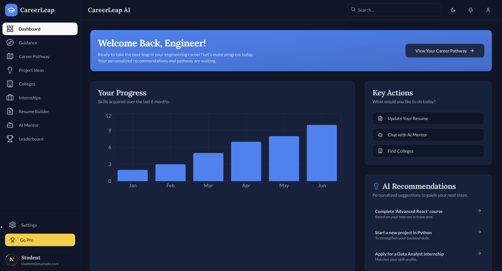
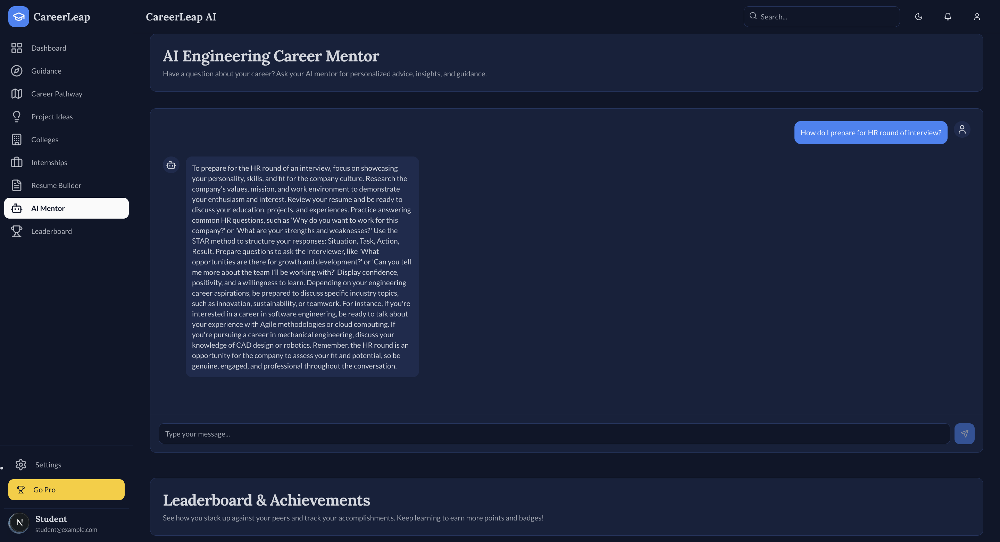
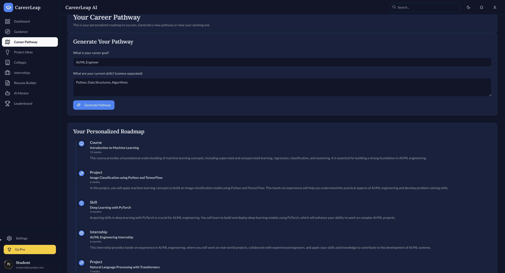
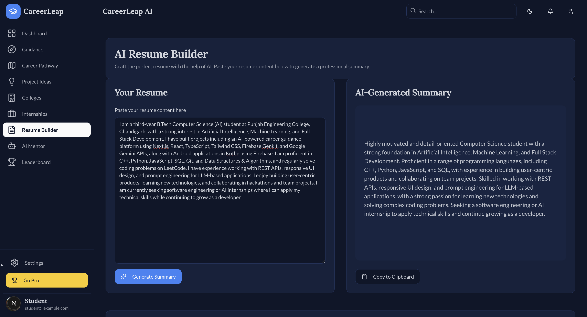
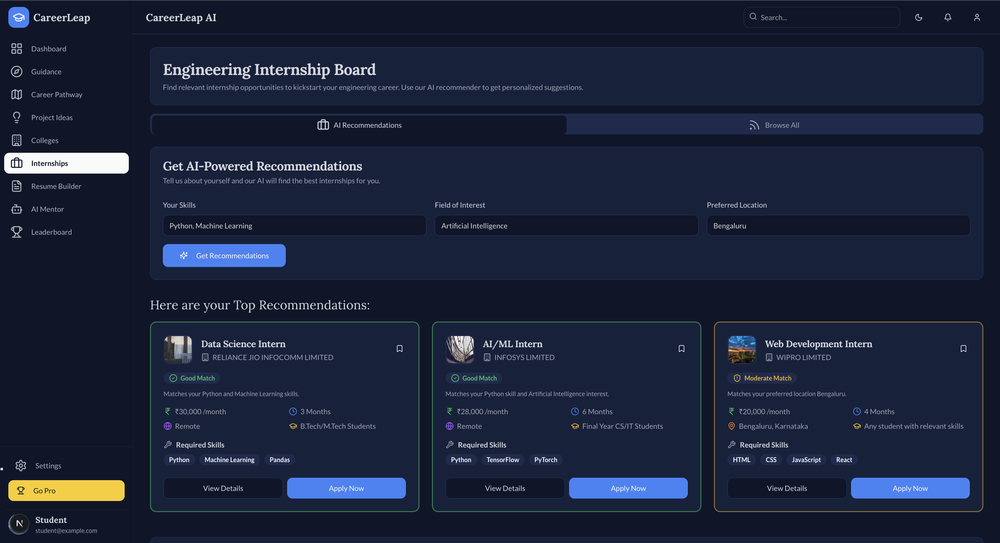
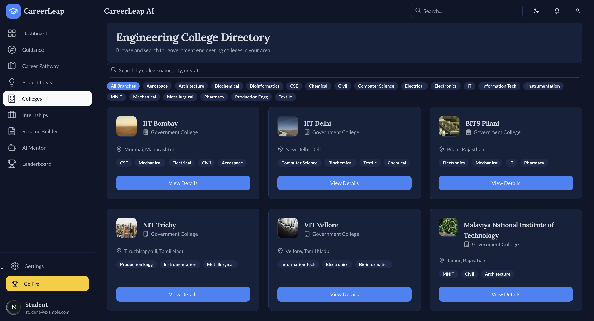
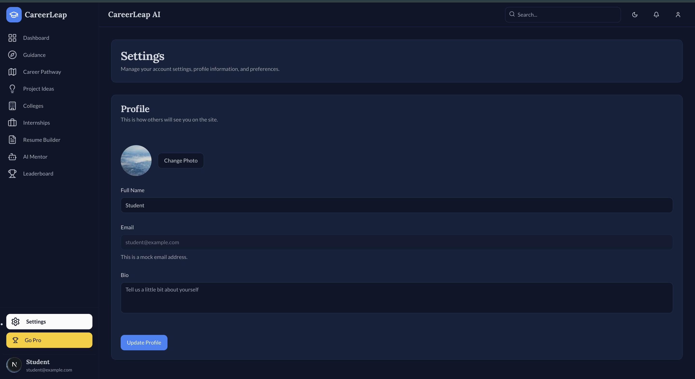
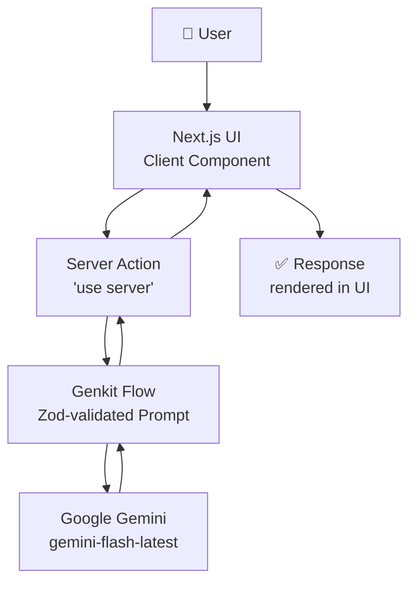

<div align="center">

# 🚀 CareerLeap AI

### Your AI-Powered Engineering Career Co-Pilot

**From choosing a specialization to landing an internship — one platform, powered by Google Gemini.**

[](https://nextjs.org/)
[](https://react.dev/)
[](https://www.typescriptlang.org/)
[](https://tailwindcss.com/)
[](https://firebase.google.com/docs/genkit)
[](https://ai.google.dev/)
[](#-license)

[Live Demo](#-live-demo) • [Features](#-key-features) • [AI Capabilities](#-ai-capabilities) • [Tech Stack](#-tech-stack) • [Installation](#-installation) • [Usage](#-usage)

</div>

<details>
<summary><strong>📚 Table of Contents</strong></summary>

1. [About](#-about)
2. [Why I Built CareerLeap AI](#-why-i-built-careerleap-ai)
3. [Live Demo](#-live-demo)
4. [Screenshots](#-screenshots)
5. [Key Features](#-key-features)
6. [AI Capabilities](#-ai-capabilities)
7. [Tech Stack](#-tech-stack)
8. [Project Architecture](#️-project-architecture)
9. [Installation](#-installation)
10. [Environment Variables](#-environment-variables)
11. [Usage](#-usage)
12. [Project Structure](#-project-structure)
13. [Performance & Code Quality](#-performance--code-quality)
14. [Engineering Challenges](#-engineering-challenges)
15. [Future Improvements](#️-future-improvements)
16. [Contributing](#-contributing)
17. [License](#-license)
18. [Author](#-author)
19. [What I Learned](#-what-i-learned)

</details>

---

## 📖 About

Engineering students face "choice paralysis" at nearly every step of their journey — which specialization to pick, what to build for a portfolio, which internship actually fits their skills, and how to write a resume and cover letter that stand out. **CareerLeap AI** is a single, cohesive dashboard that replaces that guesswork with structured, AI-generated guidance: a specialization quiz, a personalized career roadmap, an AI mentor chat, an AI-matched internship board, and a resume/cover-letter workspace — all built on Google Gemini via Firebase Genkit.

This repository is a real, working Next.js application — every feature described below is implemented and runnable, not a mockup.

---

## 💡 Why I Built CareerLeap AI

As an engineering student, I noticed that students use multiple disconnected platforms for career guidance, resume building, internship discovery, and project ideas.

CareerLeap AI attempts to unify these workflows into one AI-powered platform that helps students throughout their engineering journey—from selecting a specialization to preparing for interviews and applying for internships.

---

## 🔴 Live Demo

**[🚀 View Live Demo](https://your-deployment-url.netlify.app)** *(replace with your deployed URL)*

📹 **Demo Video:** *(add a Loom / YouTube walkthrough link here)*

---

## 📸 Screenshots

<div align="center">

|                                     Dashboard                                     |                                    AI Mentor                                    |
| :---------------------------------------------------------------------------------: | :--------------------------------------------------------------------------------: |
|  |  |

|                                 Career Pathway                                 |                                Resume Builder                                |
| :-------------------------------------------------------------------------------: | :------------------------------------------------------------------------------: |
|  |  |

|                                    Internship Recommendations                                    |                                 College Guidance                                 |
| :--------------------------------------------------------------------------------------------------: | :----------------------------------------------------------------------------------: |
|  |  |

|                                Settings                               |
| :------------------------------------------------------------------: |
|  |

</div>

> 📌 **Note:** Add real screenshots to `docs/screenshots/` and update the paths above — the app currently redirects `/` straight to the Dashboard, so there is no separate marketing landing page to capture.

---

## ✨ Key Features

### 🤖 AI Features
| Feature | Description |
|---|---|
| **AI Career Mentor** | Live chat interface answering open-ended career questions, powered by Gemini |
| **AI Specialization Guidance** | Interactive quiz mapping interests & personality traits to an engineering branch |
| **AI Career Pathway Generator** | Generates a 3–5 milestone roadmap (courses, projects, internships, skills) for any career goal |
| **AI Project Idea Generator** | Suggests portfolio-ready project ideas with recommended tech stacks |
| **AI Resume Summary Generator** | Turns pasted resume content into a polished professional summary |
| **AI Internship Matching** | Ranks a curated internship list against a candidate's skills, interest, and location |
| **AI Resume-to-Internship Match Score** | Scores a resume against one specific internship, with strengths and gaps |
| **AI Cover Letter Generator** | Drafts a tailored, ready-to-edit cover letter for a specific internship |

### 🎯 Career Development
- Specialization guidance quiz with AI-backed reasoning
- Visual, milestone-based career pathway timeline

### 📄 Resume Tools
- AI-generated resume summaries
- One resume draft, reused automatically across the Resume Builder and Internship "Prepare & Apply" flow (persisted locally per browser)

### 💼 Internship Discovery
- AI-powered recommendations *and* a plain browsable board — real listings from real companies (TCS, Reliance Jio, Tata Steel, Wipro, Infosys, HDFC Bank, L&T, Tech Mahindra), each linking to that company's actual careers page
- A dedicated **Apply workspace** per internship: full details, an instant heuristic skill-overlap score, an AI-generated match score with strengths/gaps, AI cover letter drafting with copy-to-clipboard, bookmarking, and an honest "Mark as Applied" tracker (this app never submits a fake application anywhere — it prepares you, then hands off to the real employer site)

### 🎓 College Guidance
- Directory of real engineering colleges (IITs, NITs, BITS Pilani, VIT, MNIT)
- Search by name/city/state and filter by branch
- Detail view with admission exam, founding year, and a link to the college's real official website

### 📊 Dashboard
- Skills-progress chart, quick-action shortcuts, and a personalized suggestions panel

### 🎮 Gamification
- Points, badges, and a leaderboard *(currently demo data — not yet wired to real user activity; see [Future Improvements](#-future-improvements))*

### 🌓 User Experience
- Full dark/light theming
- Responsive sidebar (collapsible rail on desktop, slide-over sheet on mobile)
- Every AI action has a request timeout, graceful error toasts, and retry affordances — no feature can hang indefinitely on a slow or failed model call

---

## 🧠 AI Capabilities

CareerLeap AI's entire AI layer is built on **[Firebase Genkit](https://firebase.google.com/docs/genkit)** as the orchestration framework, calling **Google Gemini** through the `@genkit-ai/googleai` plugin. Every AI feature follows the same consistent pattern:

```
Zod schema (input/output) → Genkit prompt/flow → Server Action → React client component
```

This means every model response is **schema-validated** before it ever reaches the UI — if Gemini's output doesn't match the expected shape, the flow rejects it rather than rendering malformed data.

<details>
<summary><strong>📋 All 8 Genkit flows in this project</strong></summary>

| Flow | File | Purpose |
|---|---|---|
| `suggestStream` | `src/ai/flows/suggest-stream.ts` | Recommends an engineering specialization from interests + personality |
| `suggestCareerPathway` | `src/ai/flows/suggest-career-pathway.ts` | Generates a milestone-based career roadmap |
| `suggestProjectIdea` | `src/ai/flows/suggest-project-idea.ts` | Generates portfolio project ideas for a field of interest |
| `suggestResumeSummary` | `src/ai/flows/suggest-resume-summary.ts` | Writes a professional resume summary from pasted content |
| `provideCareerMentorship` | `src/ai/flows/provide-career-mentorship.ts` | Free-form career Q&A chat |
| `suggestInternships` | `src/ai/flows/suggest-internships.ts` | Ranks internships against a candidate profile |
| `matchResumeToInternship` | `src/ai/flows/match-resume-to-internship.ts` | Scores a resume against one specific internship |
| `generateCoverLetter` | `src/ai/flows/generate-cover-letter.ts` | Drafts a cover letter tailored to one internship |

</details>

The model is configured once, in `src/ai/genkit.ts`, and shared by every flow — currently pointed at `googleai/gemini-flash-latest` (Google's self-maintained alias for the current recommended Flash model, chosen specifically so this project doesn't silently break when a dated model version is retired).

---

## 🛠 Tech Stack

| Category | Technology |
|---|---|
| **Framework** | [Next.js 15](https://nextjs.org/) (App Router, Turbopack dev server) |
| **UI Library** | [React 18](https://react.dev/) |
| **Language** | [TypeScript](https://www.typescriptlang.org/) |
| **Styling** | [Tailwind CSS](https://tailwindcss.com/) |
| **Component Library** | [shadcn/ui](https://ui.shadcn.com/) (built on Radix UI primitives) |
| **AI Orchestration** | [Firebase Genkit](https://firebase.google.com/docs/genkit) |
| **LLM Provider** | [Google Gemini](https://ai.google.dev/) via `@genkit-ai/googleai` |
| **Forms & Validation** | [React Hook Form](https://react-hook-form.com/) + [Zod](https://zod.dev/) |
| **Icons** | [Lucide React](https://lucide.dev/) |
| **Charts** | [Recharts](https://recharts.org/) |
| **Theming** | [next-themes](https://github.com/pacocoursey/next-themes) |
| **Carousel** | [Embla Carousel](https://www.embla-carousel.com/) |
| **Styling Utilities** | `clsx`, `tailwind-merge`, `class-variance-authority` |
| **Linting** | ESLint (`next/core-web-vitals`, `next/typescript`) |

---

## 🏗️ Project Architecture

Every AI feature in this app follows the exact same request flow, end to end:



- **Next.js UI** — a React Client Component collects input (a form, a chat message) and calls a Server Action directly — no separate REST API layer exists.
- **Server Action** — a `'use server'` function wraps the corresponding Genkit flow in a `try/catch`, always returning a `{ success, data, error }` envelope so the UI never has to handle a raw thrown exception.
- **Genkit Flow** — defines the prompt template and a Zod input/output schema; Genkit rejects any Gemini response that doesn't match the schema.
- **Response** — the client applies a request timeout (60s) around every call, so a slow or failed model response always resolves into a toast + retry option instead of an indefinitely spinning UI.

---

## ⚙️ Installation

### Prerequisites
- **Node.js** v18.0.0 or higher
- **npm** (or your package manager of choice)
- A **Google Gemini API key** — get one free at [Google AI Studio](https://aistudio.google.com/app/apikey)

### Setup

```bash
# 1. Clone the repository
git clone <your-repo-url>
cd <your-repo-folder>

# 2. Install dependencies
npm install

# 3. Configure environment variables
cp .env.local.example .env.local   # or create .env.local manually — see below
```

Add your Gemini key to `.env.local`:

```env
GEMINI_API_KEY=your_gemini_api_key_here
```

```bash
# 4. Run the development server
npm run dev
```

Open **[http://localhost:9002](http://localhost:9002)** — the dev server runs on port `9002` (via Turbopack), not the Next.js default of 3000.

<details>
<summary><strong>Optional: run the Genkit developer UI</strong></summary>

Genkit ships its own local inspector for testing flows in isolation, outside the Next.js app:

```bash
npm run genkit:dev     # one-time start
npm run genkit:watch   # auto-restart on flow file changes
```

</details>

---

## 🔑 Environment Variables

| Variable | Required | Description |
|---|:---:|---|
| `GEMINI_API_KEY` | ✅ Yes | Your Google Gemini API key. Every AI feature in this app depends on it — without it, AI calls will fail with an authentication error. Get one at [Google AI Studio](https://aistudio.google.com/app/apikey). |

> This is currently the **only** environment variable the application reads. Firebase Authentication/Firestore are not yet wired up (see [Future Improvements](#-future-improvements)) — when they are, their config variables will be documented here.

---

## 📘 Usage

| Feature | How to use it |
|---|---|
| **Guidance Quiz** | Select a few interests and personality traits, then click *Get My Recommendation* for an AI-suggested engineering specialization with reasoning. |
| **Career Pathway** | Enter a career goal and current skills, then generate a milestone-based roadmap rendered as a visual timeline. |
| **Project Ideas** | Enter a field of interest to get 3–4 AI-generated project ideas with suggested technologies. |
| **Resume Builder** | Paste your existing resume content to generate a polished professional summary; the pasted content is remembered for the Internship flow too. |
| **AI Mentor** | Ask any open-ended career question in the chat. Failed messages stay visible with a **Retry** button — nothing is silently lost. |
| **Internships** | Switch between *AI Recommendations* (personalized, based on skills/interest/location) and *Browse All*. Click **View Details** or **Apply Now** on any card to open the Apply workspace — get a resume match score, generate a cover letter, bookmark it, or mark it applied. |
| **Colleges** | Search by name, city, or state, or filter by branch tag. Click **View Details** for admission exam info and a link to the college's official site. |
| **Settings** | Update your profile info from its own dedicated page (`/settings`), reachable from the sidebar or header menu. |

---

## 📁 Project Structure

```
src/
├── ai/
│   ├── genkit.ts              # Shared Genkit + Gemini client configuration
│   ├── schemas.ts             # All Zod input/output schemas for every AI flow
│   ├── dev.ts                 # Registers flows for the Genkit dev inspector
│   └── flows/                 # 8 Genkit flows — one file per AI capability
│
├── app/
│   ├── page.tsx                # Redirects "/" → "/dashboard"
│   ├── layout.tsx               # Root layout: fonts, theme provider, toaster
│   └── (app)/                   # Authenticated app shell (shared sidebar + header)
│       ├── dashboard/           # Main single-page dashboard (all feature sections)
│       ├── settings/            # Standalone Settings/Profile route
│       └── */actions.ts         # Server Actions per feature, wrapping AI flows
│
├── components/
│   ├── career-mentor/           # AI Mentor chat interface
│   ├── career-pathway/          # Pathway generator + timeline
│   ├── colleges/                # College directory, search/filter, details dialog
│   ├── internships/              # Internship board, recommender, Apply dialog
│   ├── resume-builder/          # AI resume summary form
│   ├── guidance/                # Specialization quiz + result card
│   ├── projects/                # Project idea generator
│   ├── dashboard/                # Welcome banner, progress chart, quick actions
│   ├── leaderboard/               # Leaderboard table + gamification badges
│   ├── layout/                   # Sidebar, header, app shell
│   └── ui/                       # shadcn/ui primitives (button, dialog, tabs, etc.)
│
├── hooks/
│   ├── use-local-id-set.ts      # Generic localStorage-backed id-set (Saved/Applied)
│   ├── use-resume-draft.ts       # Persisted resume text, shared across features
│   └── use-toast.ts              # Toast notification state
│
└── lib/
    └── utils.ts                  # `cn()` class helper + `withTimeout()` AI request guard
```

---

## ⚡ Performance & Code Quality

- ✅ **Strict TypeScript** across the entire codebase — `npm run typecheck` passes with zero errors
- ✅ **ESLint enabled** (`next/core-web-vitals` + `next/typescript`) — `npm run lint` passes clean
- ✅ **Production build verified** — `npm run build` succeeds with no warnings beyond a benign third-party dependency notice
- ✅ **Resilient AI calls** — every model request is wrapped in a 60-second timeout with try/catch/finally, so a slow or failed call always resolves gracefully instead of leaving the UI stuck loading
- ✅ **Consistent architecture** — all 8 AI features share the identical schema → flow → action → hook pattern, making the codebase predictable to navigate and extend
- ✅ **Fully responsive** — mobile sheet navigation, responsive grid layouts throughout
- ✅ **Dark/light theme support** via CSS variables and `next-themes`

---

## 🚧 Engineering Challenges

While building CareerLeap AI, I solved several real-world engineering problems:

- Secured Gemini API keys using environment variables.
- Re-enabled strict TypeScript and ESLint checks.
- Refactored duplicated AI workflows into reusable patterns.
- Fixed broken navigation and UI issues.
- Added timeout handling and graceful error recovery for AI requests.
- Improved responsiveness across desktop and mobile.
- Built reusable dialog components for internships and colleges.

---

## 🗺️ Future Improvements

- [ ] **Firebase Authentication** — real user accounts (currently a single hardcoded demo profile)
- [ ] **Firestore persistence** — move Saved/Applied internships and resume drafts from browser-local storage to a real cloud-synced database
- [ ] **Resume history** — store multiple resume versions and past AI-generated summaries
- [ ] **AI-powered college recommendations** — extend the same matching pattern already used for internships to the College Directory
- [ ] **Analytics** — track quiz results, pathway completions, and applications over time for the Dashboard's progress chart (currently illustrative data)
- [ ] **Notifications** — real-time alerts for new matching internships or pathway milestones
- [ ] **Real payment integration** — the "Go Pro" pricing dialog is currently a UI concept only

---

## 🤝 Contributing

Contributions are welcome!

1. **Fork** the repository
2. **Create a feature branch**: `git checkout -b feature/amazing-feature`
3. **Commit your changes**: `git commit -m "Add amazing feature"`
4. **Push to your branch**: `git push origin feature/amazing-feature`
5. **Open a Pull Request** describing what changed and why

Please run `npm run typecheck` and `npm run lint` before opening a PR — both must pass clean.

---

## 📄 License

Distributed under the **MIT License**. See [`LICENSE`](./LICENSE) for details.

---

## 👤 Author

**Tanisha**

[](https://github.com/Tanisha-1607)
[](https://linkedin.com/in/your-profile)

---

## 🎓 What I Learned

This project helped me gain practical experience with

- Next.js App Router
- Server Actions
- Firebase Genkit
- Google Gemini APIs
- TypeScript
- Tailwind CSS
- Prompt Engineering
- Responsive UI Design
- Error Handling
- State Management
- Environment Variables
- Production Deployment

---

<div align="center">

*Built with ❤️ to help engineering students navigate their career journey.*

</div>
